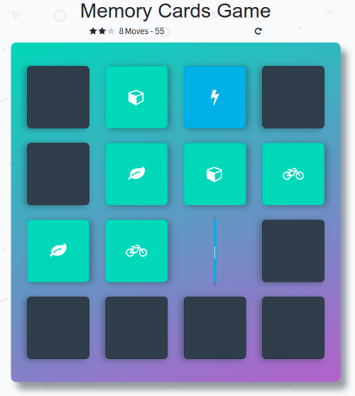

# Memory Cards Game Project

The browser-based card matching game is all about demonstrating mastery of HTML, CSS, and JavaScript.

## Live Version

Click [here](https://karoldavid.github.io/memory-card-game/) to see a live version.

## Features

1. Star Rating
2. Move Counter
3. Game Timer
4. Reset Button
5. Two Pop Up Modals (You Win! and Time Out!)

## Getting Started

1. Clone or download the repository.
2. `cd` into the project directory.
3. Double click index.html to open the Memory Cards Game in a browser.
4. Switch branches to see the Vanilla JavaScript and the jQuery version.

## Author

* **Karol Zyskowski**

Questions? Send an email to: k.zysk@zoho.com

## Contributing

This is a project of the Udacity Front-End Web Dev Nanodegree.Therefore, I will most likely not accept pull requests.

## License

This project is licensed under the MIT License - see the [LICENSE.md](LICENSE.md) file for details.

## Acknowledgements

* https://www.udacity.com/course/front-end-web-developer-nanodegree--nd001
